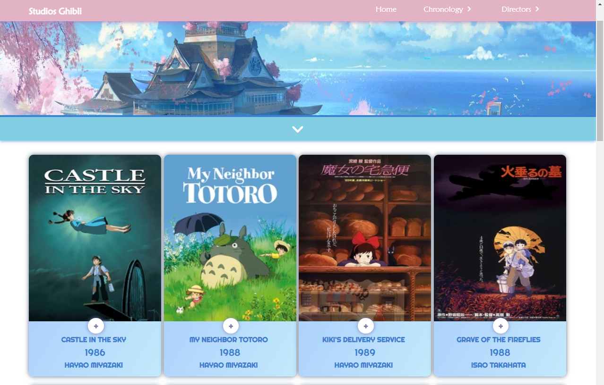
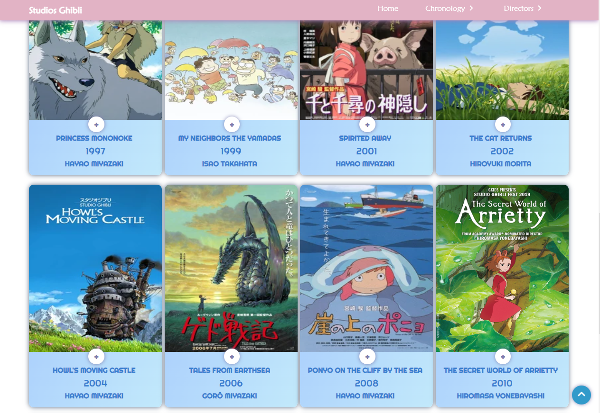
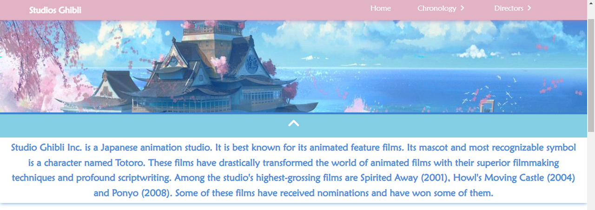
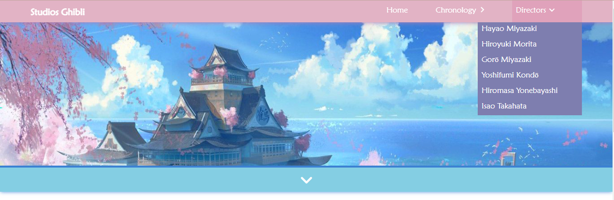
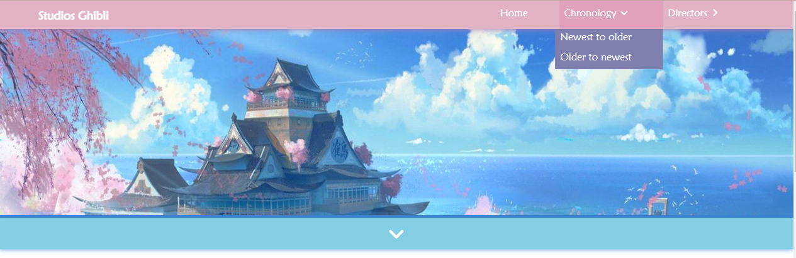

 # Data Lovers

## Índice

* [1. Resumen del proyecto](#1-Resumen-del-Proyecto)
* [2. Imagen final del proyecto](#2-Imagen-final-del-proyecto)
* [3. Investigación: Quiénes son los usuarios y los objetivos en relación con el producto](#3-investigación-quiénes-son-los-usuarios-y-los-objetivos-en-relación-con-el-producto)

***

## 1. Resumen del Proyecto

Ghibli lovers trae a los usuarios una plataforma en la que podran encontrar todas las peliculas del mundo ghibli, podran seleccionar las peliculas por el director y podran filtrar de las peliculas mas nuevas a las más viejas y de las más viejas a las más nuevas.

## 2. Imagen final del proyecto

"Historia de Usuario 1"

"Historia de Usuario 2"

"Historia de Usuario 3"

"Paleta de Colores"

## 3. Investigación: Quiénes son los usuarios y los objetivos en relación con el producto

Los usuarios quieren encontrar una plataforma que como fans de las peliculas del mundo Ghibli las encuentren en un solo lugar.

- Encontraran todas las peliculas y podran filtrarlas por año, director, y otras caracteristicas particulares

